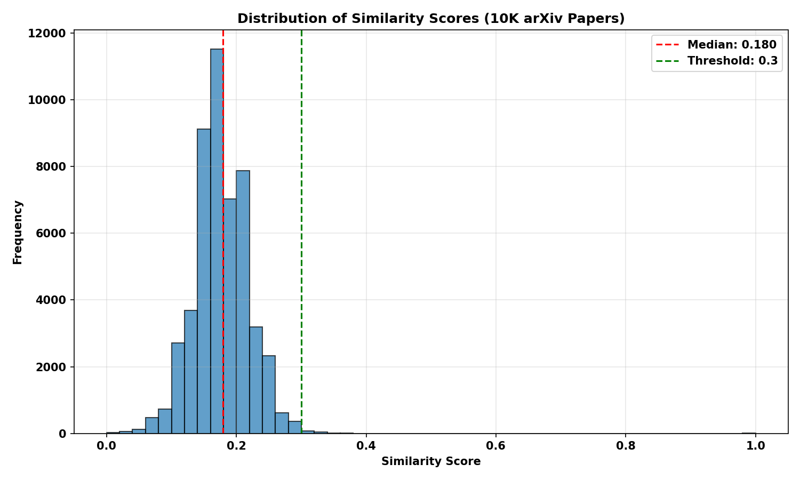

# Real-Time Document Similarity Engine

> Finding near-duplicate and related documents in milliseconds using MinHash LSH and distributed computing

**Status:** 🚧 In Development - Phase 1

## Project Overview

A production-grade document similarity system that processes streaming documents, identifies near-duplicates, and surfaces related content in real-time.

**Use Case:** Plagiarism Detection for arXiv Papers
- **Dataset:** 100K arXiv paper abstracts
- **Problem:** Identify submitted papers similar to existing work
- **Scale:** Processing 100K+ documents
- **Requirement:** Sub-second query response for new submissions

## Tech Stack

- **Core Algorithm:** MinHash + Locality-Sensitive Hashing (LSH)
- **Distributed Computing:** Apache Spark
- **Storage:** Redis (in-memory index)
- **API:** FastAPI
- **Deployment:** Docker

## Project Timeline

- [x] **Phase 1:** System Architecture & Local Prototype
- [ ] **Phase 2:** Scale with Spark + Distributed Storage
- [ ] **Phase 3:** REST API + Query Service
- [ ] **Phase 4:** Production Deployment & Monitoring

## Current Phase: Phase 1 - Local Prototype

### Progress
- [x] Project setup
- [x] Dataset acquisition (arXiv 100K abstracts)
- [x] MinHash implementation
- [x] Text preprocessing pipeline
- [x] Baseline end-to-end demo

## Demo Results

### Performance on 10K arXiv Papers



**Key Findings:**
- **Query latency:** 218ms (sub-second response ✅)
- **Median similarity:** 0.18 (healthy distribution, no pathological clustering)
- **Threshold:** 0.3 effectively filters top ~15-20% most similar papers
- **Indexing throughput:** 4 docs/sec (identified bottleneck for Phase 2 optimization)

The system successfully identifies similar papers across diverse domains (physics, mathematics, computer science) with consistent performance.

## Repository Structure
```
├── data/                  # Dataset files (not tracked in git)
├── docs/                  # Documentation
├── notebooks/             # Jupyter notebooks for exploration
├── src/                   # Source code
│   ├── similarity/        # MinHash + LSH implementation
│   ├── preprocessing/     # Text processing
│   └── pipeline/          # End-to-end pipeline
├── tests/                 # Unit tests
├── README.md
└── requirements.txt
```

## Setup Instructions

Phase 1: Done!!

---

**Portfolio Context:** This project demonstrates end-to-end ML system design, scalable algorithms, and production engineering thinking - translating academic ML concepts into deployable systems.